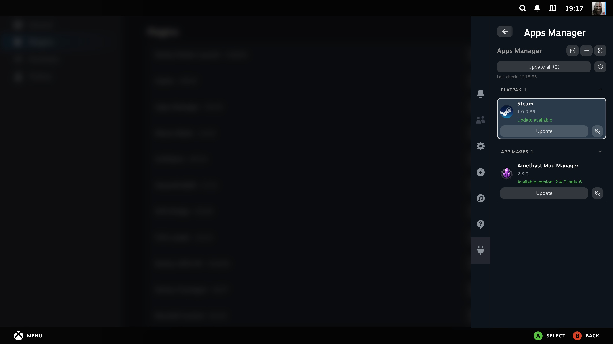
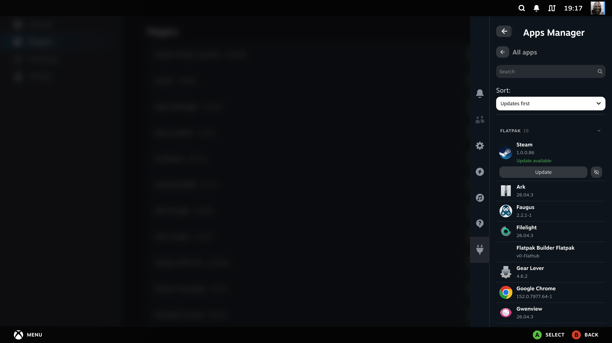
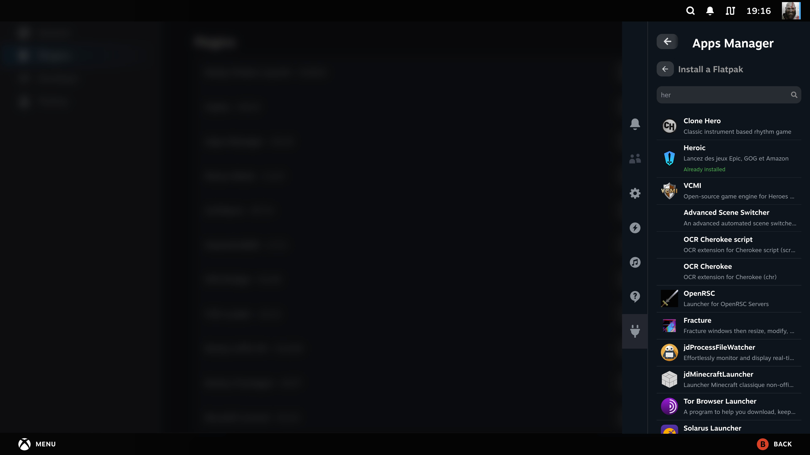
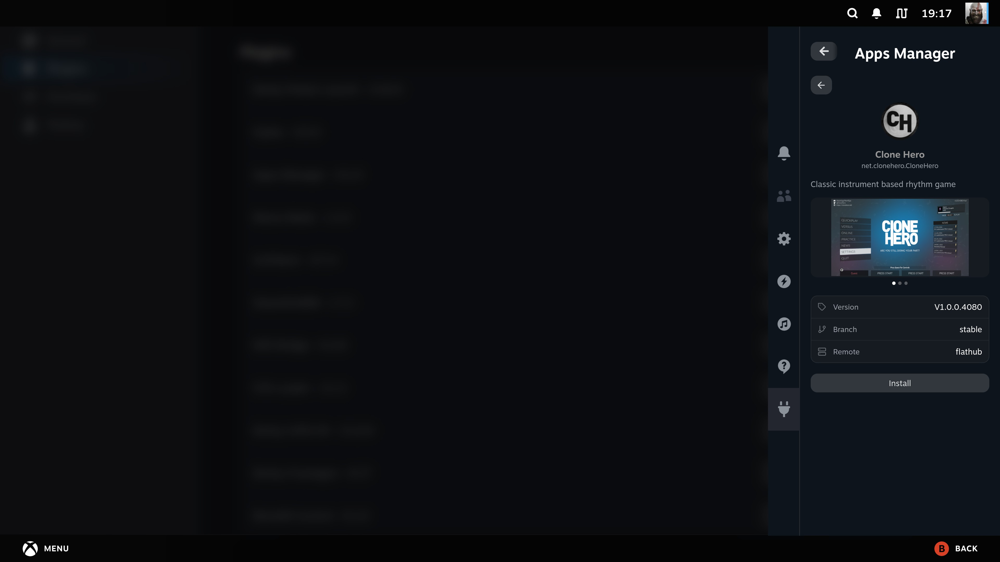
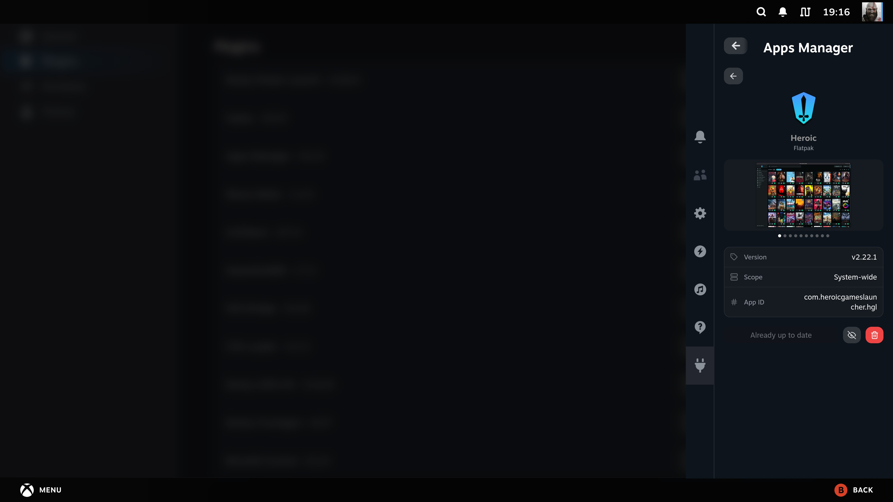
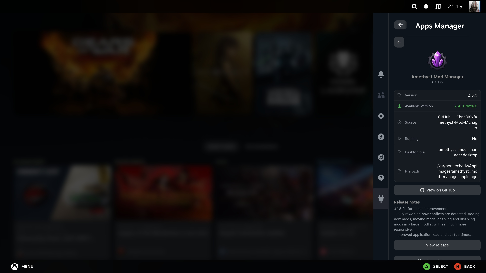
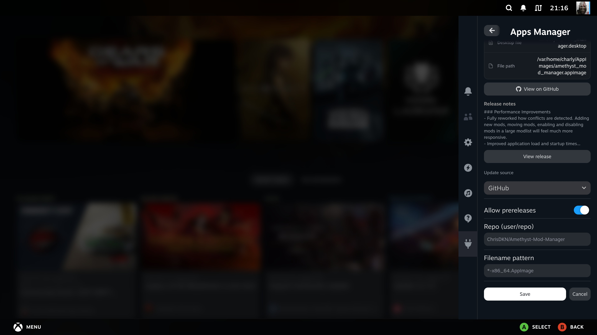
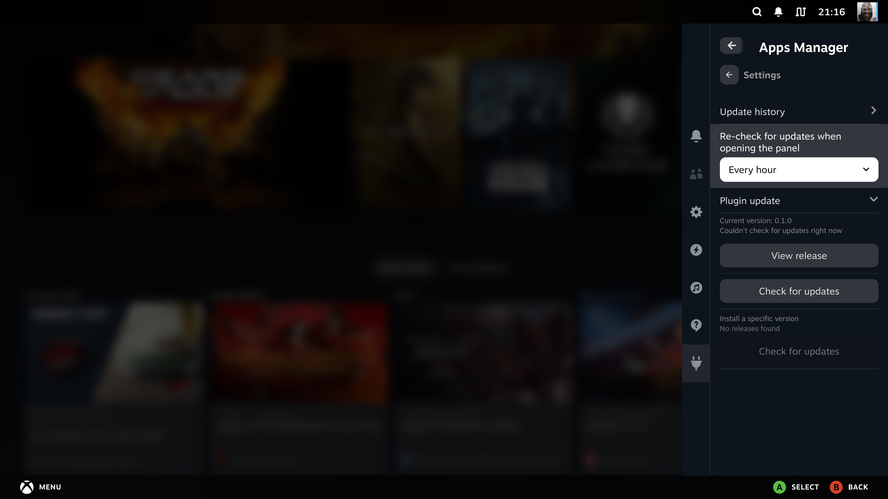

# decky-apps-manager


**Manage and update your Flatpak apps and AppImages easily right from SteamOS's Gaming Mode, via Decky Loader.**

Apps Manager keeps track of every Flatpak app you have installed (including the ones Discover put there) and every AppImage managed by Gearlever, flags the ones with an update available, and lets you update them — or discover and install a brand new Flatpak or AppImage, screenshots included — without ever leaving Steam's Quick Access menu.

> 🙏 **Thanks to [Gearlever](https://github.com/mijorus/gearlever)** by [mijorus](https://github.com/mijorus) — the AppImage side of this plugin runs entirely on top of it.

### ✨ New in 0.1.0

- First release
- Track your Flatpak apps and Gearlever AppImages, with updates flagged automatically
- Search and install new Flatpaks and AppImages, screenshots included
- Update everything at once or one app at a time
- Exclude apps you don't want to be nagged about
- Sort your list — updates first, or alphabetically
- Choose how often the panel re-checks for updates on its own

---

## Screenshots

### Home

The Quick Access menu view — everything that currently has an update available, updates first.



### All apps

Every installed app, Flatpak and AppImage side by side, with search and a sort picker.



### Searching and installing a Flatpak

Search across every remote you've configured — an app you already have installed is flagged as such right in the results — and open its store page to install it.




### Flatpak app detail page

Click any installed Flatpak for its version, available update, and update/remove actions.



### AppImage app detail page

Same idea for a Gearlever AppImage, plus its own update source form when one isn't configured yet.




### Settings

Check for plugin updates, install a specific version, or browse the update history.



---

## Features

- Lists installed Flatpak apps (both the system-wide installation — where Discover/`sudo flatpak install` land apps — and the per-user installation) and flags which ones have an update available
- **Search and install a Flatpak** from any remote you have configured (Flathub or otherwise), right from the panel — no need to open Discover; screenshots shown on each app's page when the remote provides them
- **Remove a Flatpak app**, with an inline confirmation step
- Lists AppImages managed by [Gearlever](https://github.com/mijorus/gearlever), if it's installed, and flags which ones have an update available
- **Search and install an AppImage** from the [AppImageHub](https://appimage.github.io/) community feed, screenshots included — an entry already installed is flagged as such instead of offering to install it again, and opens the same detail page as the rest of your list
- **Remove an AppImage**, with an inline confirmation step
- **Update all** (with a confirmation prompt), or update a single app from its own page
- **Exclude an app from updates** — a dedicated page lists everything currently excluded, with a one-tap way to re-include it
- **Sort your list** — updates first (default), or alphabetically, either direction
- For a Gearlever AppImage with no update source configured, a small form lets you set one (GitHub/GitLab/Codeberg/Forgejo releases, or a static URL) directly from the panel; installing straight from the AppImage catalog configures it automatically
- Periodic background check that notifies you when updates become available, even if the panel was never opened, plus a settings toggle for how often simply opening the panel is allowed to re-check on its own
- If Gearlever isn't installed, a one-tap notice offers to install it via Flatpak
- Available in English and French

---

## Installation

Download the latest release zip from the [Releases page](https://github.com/moi952/decky-apps-manager/releases/latest) and load it via Decky Loader, or build from source:

1. Clone the repository:

```bash
git clone https://github.com/moi952/decky-apps-manager.git
```

2. Install dependencies:

```bash
pnpm install
```

3. Build the plugin:

```bash
pnpm run build
./package.sh          # zips everything into packages/, ready for Decky Loader
```

4. Load the plugin via Decky Loader.

---

## Contributing

Contributions are welcome!

- **New language**: add a JSON file in `src/i18n/locales/` following the existing structure and open a PR.
- **Bug report / idea**: open an issue.

---

## License

BSD-3-Clause License
